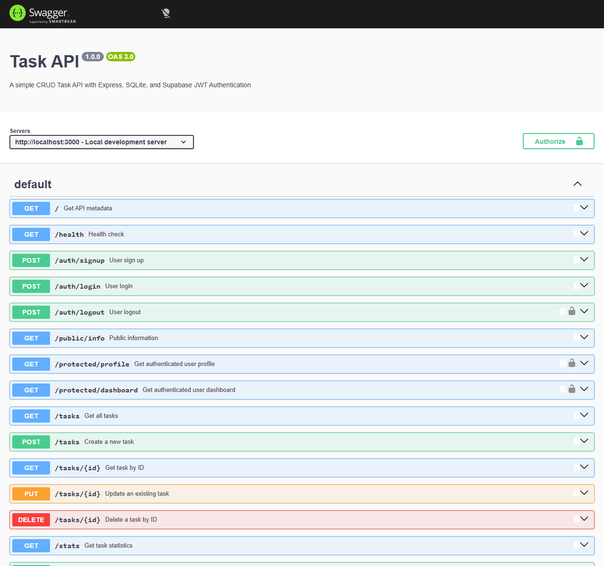

# Task CRUD API (Auth & SQLite Edition)

A robust REST API built with Node.js, Express, persistent SQLite storage, and secure authentication powered by Supabase Auth and JWT access tokens. This project features full CRUD management for tasks, database persistence across restarts, query filtering, aggregation statistics, reusable authentication middleware, and interactive Swagger UI documentation with Bearer authentication.

---

## 1. Project Description

This project is a backend Task Management API built with Express.js. Originally implemented with in-memory storage (A1) and upgraded to a persistent SQLite database (A2/A3), this iteration (**Assignment A4**) introduces secure user authentication, token-based session management, and route protection using Supabase Auth, while strictly preserving all previous task CRUD capabilities, schema definitions, and validation logic.

---

## 2. Assignment A4 – Authentication

### Overview
Assignment A4 upgrades the Task API with secure, stateless user authentication powered by Supabase Auth (`@supabase/supabase-js`) while preserving the existing SQLite task storage.

### Core Authentication Components:
1. **Supabase Authentication**: Acts as the external Identity Provider (IdP) for managing user credentials, secure hashing, and authentication tokens.
2. **Signup (`POST /auth/signup`)**: Registers a new user account with email and password via `supabase.auth.signUp()`.
3. **Login (`POST /auth/login`)**: Authenticates users with credentials via `supabase.auth.signInWithPassword()` and returns JWT `access_token` and `refresh_token`.
4. **JWT Access Tokens**: Stateless JSON Web Tokens securely encode identity and claims.
5. **Bearer Authentication**: Protected endpoints require the `Authorization: Bearer <access_token>` header.
6. **Protected Routes (`GET /protected/profile`, `GET /protected/dashboard`)**: Verified routes that expose authenticated user context.
7. **Public Route (`GET /public/info`)**: Unprotected endpoint accessible without authentication.
8. **Logout (`POST /auth/logout`)**: Protected endpoint that terminates the user session via `supabase.auth.signOut()`.
9. **Reusable Authentication Middleware**: The `requireAuth` middleware ([middleware/auth.js](middleware/auth.js)) handles Bearer header extraction, validates format, calls `supabase.auth.getUser(token)`, and attaches `req.user`.
10. **Swagger UI Authentication**: Full Bearer JWT authorization support with interactive lock controls at `/docs`.

---

## 3. Technologies Used

- **Node.js** (ES Modules)
- **Express.js** (v5.x)
- **Supabase Auth** (`@supabase/supabase-js`)
- **SQLite & better-sqlite3** (for synchronous local SQL operations)
- **dotenv** (for environment variable management)
- **Swagger UI & OpenAPI 3.0** (`swagger-ui-express`)

---

## 4. Environment Setup

The application uses environment variables loaded via `dotenv`.

### Configuration Template (`.env.example`)
```env
SUPABASE_URL=your_supabase_project_url
SUPABASE_KEY=your_supabase_anon_or_publishable_key
PORT=3000
```

> [!IMPORTANT]
> Real credentials belong exclusively in `.env` and must **never** be committed to Git. `.env` is explicitly ignored by `.gitignore`.

### Local Setup Instructions
1. Copy `.env.example` to `.env`:
   ```bash
   cp .env.example .env
   ```
2. Populate `.env` with your Supabase project URL and public anon/publishable key.

---

## 5. Installation & Startup

1. **Install dependencies**:
   ```bash
   npm install
   ```

2. **Start the server**:
   ```bash
   npm start
   ```
   The API will be available at: **`http://localhost:3000`**.

---

## 6. API Endpoints Reference

### Authentication & Protected Endpoints (A4)

| Method | Endpoint | Auth Required? | Description | Success Status | Error Statuses |
| :--- | :--- | :--- | :--- | :--- | :--- |
| **POST** | `/auth/signup` | No | Register new user account | `201 Created` | `400 Bad Request` |
| **POST** | `/auth/login` | No | Login and obtain JWT tokens | `200 OK` | `400 Bad Request`, `401 Unauthorized` |
| **POST** | `/auth/logout` | **Yes (Bearer)** | Terminate active user session | `204 No Content` | `401 Unauthorized` |
| **GET** | `/public/info` | No | Public welcome message | `200 OK` | - |
| **GET** | `/protected/profile` | **Yes (Bearer)** | Authenticated user profile metadata | `200 OK` | `401 Unauthorized` |
| **GET** | `/protected/dashboard` | **Yes (Bearer)** | Authenticated user dashboard data | `200 OK` | `401 Unauthorized` |

### Task Management Endpoints (A1–A3)

| Method | Endpoint | Auth Required? | Description | Success Status | Error Statuses |
| :--- | :--- | :--- | :--- | :--- | :--- |
| **GET** | `/` | No | API metadata | `200 OK` | - |
| **GET** | `/health` | No | Service health check | `200 OK` | - |
| **GET** | `/tasks` | No | Retrieve tasks (supports `done` and `search` query filters) | `200 OK` | `400 Bad Request` |
| **GET** | `/tasks/:id` | No | Get task by numeric ID | `200 OK` | `404 Not Found` |
| **POST** | `/tasks` | No | Create new task | `201 Created` | `400 Bad Request` |
| **PUT** | `/tasks/:id` | No | Update task title and/or done status | `200 OK` | `400 Bad Request`, `404 Not Found` |
| **DELETE** | `/tasks/:id` | No | Delete task by ID | `204 No Content` | `404 Not Found` |
| **GET** | `/stats` | No | Aggregate task counts | `200 OK` | - |
| **POST** | `/reset` | No | Reset task table to default 3 tasks | `200 OK` | - |
| **GET** | `/docs` | No | Interactive Swagger documentation | `200 OK` | - |

---

## 7. Status Code Specifications

- `200 OK`: Request succeeded. Returned on successful login, profile retrieval, dashboard access, and task reads/updates.
- `201 Created`: Resource created. Returned on user signup (`/auth/signup`) and task creation (`/tasks`).
- `204 No Content`: Successful action with no response body. Returned on `/auth/logout` and `/tasks/:id` deletion.
- `400 Bad Request`: Missing required input fields (`email`, `password`, `title`) or invalid query parameter formats.
- `401 Unauthorized`: Authentication failure due to invalid login credentials, missing `Authorization` header, malformed token, or expired/tampered JWT.
- `404 Not Found`: Target resource not found by ID.
- `500 Internal Server Error`: Unhandled server exception.

---

## 8. Interactive Swagger UI Documentation

Swagger UI is hosted at **`http://localhost:3000/docs`**.

### Using Bearer Authentication in Swagger UI:
1. Navigate to `http://localhost:3000/docs`.
2. Click the green **Authorize 🔓** button in the upper-right corner.
3. In the `bearerAuth (http, Bearer)` dialog, paste your JWT `access_token` and click **Authorize**.
4. Protected routes (`/protected/profile`, `/protected/dashboard`, `/auth/logout`) will now display closed locks 🔒.
5. Expand `/protected/profile`, click **Try it out**, and click **Execute** to send authenticated requests directly from the browser.


*Figure 1: Swagger UI showing OpenAPI 3.0 Bearer JWT security scheme and protected endpoints.*

---

## 9. Security & Best Practices

- **Zero Local Password Storage**: Passwords are never stored, hashed, or processed in local SQLite files.
- **No Password/Token Logging**: Application logs never output passwords, JWTs, or Authorization headers.
- **Least Privilege**: Only the public Anon key is used. The `service_role` key is strictly prohibited and unconfigured.
- **Cryptographic JWT Verification**: Every protected request is cryptographically validated with `supabase.auth.getUser()`.
- **Git Security**: Environment credentials in `.env` are strictly excluded from source control.

---

## 10. Existing SQLite Database & Persistence (A1–A3)

- **Database File**: Stored locally in `tasks.db` using `better-sqlite3`.
- **Automatic Initialization**: Creates the `tasks` table schema on launch if missing.
- **Default Seeding**: Seeds exactly 3 default tasks only when the table is empty.
- **Data Persistence**: Task additions, updates, and deletions persist across server restarts.

### DB Browser Screenshots


*Figure 2: Tasks table schema and default seeded records.*


*Figure 3: Tasks filtered by completion status.*


*Figure 4: Task aggregation query execution.*

---

## 11. Project File Structure

```text
├── docs/                        # Screenshots for Swagger and SQLite verification
│   ├── a4-swagger-auth.png      # Swagger UI Bearer authentication screenshot
│   └── db-screenhot1.png to 7   # SQLite database verification screenshots
├── middleware/
│   └── auth.js                  # Reusable Supabase Bearer JWT authentication middleware
├── .env.example                 # Placeholder environment configuration template
├── .gitignore                   # Excludes node_modules, .env, tasks.db, SQLite temp files
├── index.js                     # Express application, routes, and SQLite logic
├── openapi.json                 # OpenAPI 3.0 specification with Bearer security scheme
├── package.json                 # Project dependencies and start scripts
├── package-lock.json            # Locked dependency tree
├── supabaseClient.js            # Initialized Supabase client module
└── README.md                    # Comprehensive project documentation
```
